<div align="center">

<picture>
  <source media="(prefers-color-scheme: dark)" srcset="assets/banner-dark.svg">
  <source media="(prefers-color-scheme: light)" srcset="assets/banner-light.svg">
  
</picture>

<picture>
  <source media="(prefers-color-scheme: dark)" srcset="https://readme-typing-svg.demolab.com?font=JetBrains+Mono&weight=600&size=20&duration=2800&pause=850&color=58A6FF&center=true&vCenter=true&width=760&lines=Embedded+Systems+Engineer;Embedded+Linux+%26+Shell+Automation;Robotics+%26+ROS+2+Explorer;FPGA+%26+Computer+Vision;Open+Source+Contributor;M.Sc.+Electronics+%40+CUSAT">
  <source media="(prefers-color-scheme: light)" srcset="https://readme-typing-svg.demolab.com?font=JetBrains+Mono&weight=600&size=20&duration=2800&pause=850&color=0969DA&center=true&vCenter=true&width=760&lines=Embedded+Systems+Engineer;Embedded+Linux+%26+Shell+Automation;Robotics+%26+ROS+2+Explorer;FPGA+%26+Computer+Vision;Open+Source+Contributor;M.Sc.+Electronics+%40+CUSAT">
  
</picture>

<br><br>

[](https://muhammed-salman-cc.is-a.dev)
[](mailto:ccmuhammedsalman@gmail.com)
[](https://www.linkedin.com/in/muhammed-salman-cc-b7522433b)
[](https://github.com/ccsalman545?tab=followers)
[](https://github.com/ccsalman545?tab=repositories)
[](https://github.com/ccsalman545)

<br>

> **Building intelligent hardware and dependable software — one well-documented experiment at a time.**
> <br><br>
> `status` ▸ **Open to collaboration** · embedded systems, Embedded Linux, robotics, and open source
> <br>
> `location` ▸ Kanayannur, Kerala, India (UTC+05:30) · `signal` ▸ M.Sc. Electronics, CUSAT

</div>

<p align="center">
  <picture>
    <source media="(prefers-color-scheme: dark)" srcset="assets/divider-dark.svg">
    <source media="(prefers-color-scheme: light)" srcset="assets/divider-light.svg">
    
  </picture>
</p>

## <kbd>01</kbd> About

I am **Muhammed Salman CC**, an **M.Sc. Electronics** student at the **Cochin University of Science and Technology (CUSAT)**, based in Kerala, India. I enjoy taking an idea all the way down the stack — from circuit architecture and datasheet constraints, to firmware that behaves, to the software that makes the whole system genuinely useful.

My working orbit is **embedded systems, Embedded Linux, robotics, FPGA design, computer vision, IoT, and open source**. The long-term goal is intelligent hardware: systems where careful electronics, maintainable code, and pragmatic automation meet.

| Working style | Engineering defaults | Open-source intent |
| :-- | :-- | :-- |
| Prototype small, verify one module, then integrate | Read the datasheet before the forum | Share early, document honestly |
| Keep a lab notebook of signal paths and failures | Measure first; logs and test points beat guesses | Credit sources; welcome better approaches |
| Turn one-off scripts into reusable references | Simplify the interface, then the implementation | Make failure visible with useful errors |

---

## <kbd>02</kbd> Current focus

| Signal | Building / studying | Why it matters |
| :-- | :-- | :-- |
| `LINUX` | A practical [Linux Commands Library](https://github.com/ccsalman545/Linux-Scripts) plus Fedora automation | Command-line fluency compounds into every other engineering workflow. |
| `FIRMWARE` | Embedded C, STM32, ESP32, sensor interfaces, RTOS foundations | Reliable firmware is the bridge between a circuit and a product. |
| `ROBOTICS` | ROS 2 concepts, computer vision, FPGA image-processing experiments | Perception and control are the next layer of intelligent machines. |
| `HARDWARE` | A structured [sensor and board reference library](https://github.com/ccsalman545/Embedded-Projects) | Better references make prototypes safer and more repeatable. |

**On deck** ▸ Embedded Linux · ROS 2 · real-time systems · FPGA workflows · edge inference.

---

## <kbd>03</kbd> Technology radar

<sub>Tools I use, study, or am actively exploring. The goal is depth and sound engineering judgment — not a badge collection.</sub>

**Languages**

[](https://en.wikipedia.org/wiki/C_(programming_language))
[](https://isocpp.org/)
[](https://www.python.org/)
[](https://www.gnu.org/software/bash/)
[](https://en.wikipedia.org/wiki/Verilog)
[](https://www.typescriptlang.org/)
[](https://www.sqlite.org/)

**Operating systems & editors**

[](https://www.kernel.org/)
[](https://fedoraproject.org/)
[](https://www.debian.org/)
[](https://code.visualstudio.com/)
[](https://www.vim.org/)
[](https://www.gnu.org/software/make/)

**Embedded platforms & hardware**

[](https://www.arduino.cc/)
[](https://www.espressif.com/en/products/socs/esp32)
[](https://www.st.com/en/microcontrollers-microprocessors/stm32-32-bit-arm-cortex-mcus.html)
[](https://www.raspberrypi.com/)
[](https://en.wikipedia.org/wiki/Field-programmable_gate_array)
[](https://www.xilinx.com/products/design-tools/vivado.html)
[](https://www.kicad.org/)
[](https://en.wikipedia.org/wiki/Oscilloscope)

**AI, vision & robotics**

[](https://opencv.org/)
[](https://www.ros.org/)
[](https://numpy.org/)
[](https://en.wikipedia.org/wiki/Edge_computing)

**Tools, version control & web**

[](https://git-scm.com/)
[](https://github.com/features/actions)
[](https://www.docker.com/)
[](https://react.dev/)
[](https://vite.dev/)
[](https://tailwindcss.com/)

**Cloud, data & protocols**

[](https://firebase.google.com/)
[](https://mqtt.org/)
[](https://www.i2c-bus.org/)
[](https://en.wikipedia.org/wiki/Serial_Peripheral_Interface)
[](https://en.wikipedia.org/wiki/Universal_asynchronous_receiver-transmitter)
[](https://en.wikipedia.org/wiki/CAN_bus)

<p align="center">
  <picture>
    <source media="(prefers-color-scheme: dark)" srcset="assets/divider-dark.svg">
    <source media="(prefers-color-scheme: light)" srcset="assets/divider-light.svg">
    
  </picture>
</p>

## <kbd>04</kbd> Live dashboard

<sub>Auto-refreshing public signals. Metrics are context — not the mission.</sub>

<!-- COUNTERS:START -->
<div align="center">

[](https://github.com/ccsalman545?tab=repositories) [](https://github.com/ccsalman545?tab=repositories) [](https://github.com/ccsalman545?tab=followers) [](https://github.com/ccsalman545?tab=repositories) [](https://github.com/ccsalman545/ccsalman545/actions)

</div>
<!-- COUNTERS:END -->

<table align="center">
  <tr>
    <td>
      <picture>
        <source media="(prefers-color-scheme: dark)" srcset="https://github-readme-stats.vercel.app/api?username=ccsalman545&show_icons=true&include_all_commits=true&count_private=true&rank_icon=github&hide_border=true&theme=github_dark">
        <source media="(prefers-color-scheme: light)" srcset="https://github-readme-stats.vercel.app/api?username=ccsalman545&show_icons=true&include_all_commits=true&count_private=true&rank_icon=github&hide_border=true&theme=default">
        
      </picture>
    </td>
    <td>
      <picture>
        <source media="(prefers-color-scheme: dark)" srcset="https://github-readme-stats.vercel.app/api/top-langs/?username=ccsalman545&layout=compact&langs_count=8&hide_border=true&theme=github_dark">
        <source media="(prefers-color-scheme: light)" srcset="https://github-readme-stats.vercel.app/api/top-langs/?username=ccsalman545&layout=compact&langs_count=8&hide_border=true&theme=default">
        
      </picture>
    </td>
  </tr>
</table>

<p align="center">
  <picture>
    <source media="(prefers-color-scheme: dark)" srcset="https://streak-stats.demolab.com?user=ccsalman545&theme=github-dark-blue&hide_border=true">
    <source media="(prefers-color-scheme: light)" srcset="https://streak-stats.demolab.com?user=ccsalman545&theme=github-light&hide_border=true">
    
  </picture>
</p>

<p align="center">
  <picture>
    <source media="(prefers-color-scheme: dark)" srcset="https://github-profile-trophy.vercel.app/?username=ccsalman545&theme=onedark&no-frame=true&row=1&column=7">
    <source media="(prefers-color-scheme: light)" srcset="https://github-profile-trophy.vercel.app/?username=ccsalman545&theme=flat&no-frame=true&row=1&column=7">
    
  </picture>
</p>

<p align="center">
  <picture>
    <source media="(prefers-color-scheme: dark)" srcset="https://github-readme-activity-graph.vercel.app/graph?username=ccsalman545&bg_color=0D1117&color=C9D1D9&line=58A6FF&point=FFFFFF&area=true&hide_border=true">
    <source media="(prefers-color-scheme: light)" srcset="https://github-readme-activity-graph.vercel.app/graph?username=ccsalman545&bg_color=FFFFFF&color=24292F&line=0969DA&point=57606A&area=true&hide_border=true">
    
  </picture>
</p>

<p align="center">
  <picture>
    <source media="(prefers-color-scheme: dark)" srcset="https://raw.githubusercontent.com/ccsalman545/ccsalman545/output/github-contribution-grid-snake-dark.svg">
    <source media="(prefers-color-scheme: light)" srcset="https://raw.githubusercontent.com/ccsalman545/ccsalman545/output/github-contribution-grid-snake.svg">
    
  </picture>
</p>

---

## <kbd>05</kbd> Featured repositories

<sub>Refreshed weekly straight from the GitHub API — stars, forks, and last-push dates are never hand-edited.</sub>

<!-- REPOS:START -->
| Repository | Stack | ★ | ⑂ | Pushed |
| :-- | :-- | --: | --: | :-- |
| [**Linux-Scripts**](https://github.com/ccsalman545/Linux-Scripts)<br><sub>Useful Bash scripts and Fedora automation tools.</sub> | `automation` `bash` | 0 | 0 | Jul 17, 2026 |
| [**Embedded-Projects**](https://github.com/ccsalman545/Embedded-Projects)<br><sub>Embedded systems projects using Arduino, ESP32, STM32, and sensors.</sub> | `Python` `arduino` | 0 | 0 | Jul 17, 2026 |
| [**FPGA-Vision-Processing**](https://github.com/ccsalman545/FPGA-Vision-Processing)<br><sub>FPGA-based image processing experiments for autonomous robotics.</sub> | `computer vision` `embedded systems` | 0 | 0 | Jul 03, 2026 |
| [**muhammed-salman-portfolio**](https://github.com/ccsalman545/muhammed-salman-portfolio)<br><sub>Personal portfolio website of Muhammed Salman CC M.Sc. Electronics student focused on Embedded…</sub> | `TypeScript` | 0 | 0 | Jul 17, 2026 |
| [**Arduino-IoT**](https://github.com/ccsalman545/Arduino-IoT)<br><sub>IoT projects using Arduino and ESP32.</sub> | `arduino` `esp32` | 0 | 0 | Jul 03, 2026 |
| [**fedlock**](https://github.com/ccsalman545/fedlock)<br><sub>custom KDE Plasma 6.7 lock screen (KScreenLocker) for Fedora 44 running on Wayland. Target…</sub> | `QML` | 0 | 0 | Aug 16, 2026 |
<!-- REPOS:END -->

<p align="center">
[](https://github.com/ccsalman545?tab=repositories)
</p>

---

## <kbd>06</kbd> Latest activity

<sub>Refreshed daily from public GitHub events. Commits made to this profile repository are filtered out so the feed stays about real project work.</sub>

<!-- ACTIVITY:START -->
- **Push** — updated [ccsalman545/fedlock](https://github.com/ccsalman545/fedlock) to `main` · 18 days ago
- **Push** — updated [ccsalman545/AiCoN](https://github.com/ccsalman545/AiCoN) to `main` · 25 days ago
- **Push** — updated [ccsalman545/ideal-broccoli](https://github.com/ccsalman545/ideal-broccoli) to `main` · 3 days ago
- **Push** — updated [ccsalman545/legendary-chainsaw](https://github.com/ccsalman545/legendary-chainsaw) to `main` · 13 days ago
- **Pull request** — merged a pull request in [ccsalman545/legendary-chainsaw](https://github.com/ccsalman545/legendary-chainsaw) · 13 days ago
<!-- ACTIVITY:END -->

---

## <kbd>07</kbd> Latest writing

<!-- BLOG-POST-LIST:START -->
- *The writing feed is ready. Add a public RSS/Atom URL to the `BLOG_RSS_URL` repository variable to publish articles here automatically.*
<!-- BLOG-POST-LIST:END -->

---

## <kbd>08</kbd> Selected work

<table>
  <tr>
    <td width="50%" valign="top">

#### [Linux Commands Library](https://github.com/ccsalman545/Linux-Scripts)

[](https://www.gnu.org/software/bash/)
[](https://fedoraproject.org/)
[](https://github.com/ccsalman545/Linux-Scripts)

A structured, twenty-section Linux command reference with syntax, examples, troubleshooting, best practices, and exam-oriented notes.

**Purpose** ▸ make command-line knowledge practical and easy to revisit.
**Next** ▸ expand the library and keep the automation tools useful.

#### [Embedded Projects — Sensor & Board Reference](https://github.com/ccsalman545/Embedded-Projects)

[](https://www.python.org/)
[](https://www.espressif.com/)
[](https://www.st.com/)
[](https://github.com/ccsalman545/Embedded-Projects)

A practical catalogue of **55 sensors** and **14 development boards**, with pin references, original diagrams, selection notes, and firmware bring-up paths.

**Purpose** ▸ turn component selection into a repeatable engineering decision.
**Next** ▸ grow the cookbook with clear verification notes.

    </td>
    <td width="50%" valign="top">

#### [FPGA Vision Processing](https://github.com/ccsalman545/FPGA-Vision-Processing)

[](https://en.wikipedia.org/wiki/Field-programmable_gate_array)
[](https://en.wikipedia.org/wiki/Verilog)
[](https://opencv.org/)
[](https://github.com/ccsalman545/FPGA-Vision-Processing)

An exploration of image-processing ideas for autonomous robotics on FPGA hardware.

**Purpose** ▸ investigate the path from pixels to low-latency hardware decisions.
**Next** ▸ document experiments and make the design journey reproducible.

#### [Personal Portfolio](https://github.com/ccsalman545/muhammed-salman-portfolio)

[](https://www.typescriptlang.org/)
[](https://react.dev/)
[](https://vite.dev/)
[](https://muhammedsalmancc.netlify.app)

A responsive, accessibility-minded portfolio built with React, TypeScript, Vite, and Tailwind CSS.

**Purpose** ▸ present technical work with the same care as the work itself.
**Next** ▸ keep project stories and writing current.

    </td>
  </tr>
</table>

---

## <kbd>09</kbd> Connect

<div align="center">

[](https://muhammed-salman-cc.is-a.dev)
[](https://www.linkedin.com/in/muhammed-salman-cc-b7522433b)
[](mailto:ccmuhammedsalman@gmail.com)
[](https://github.com/ccsalman545)

</div>

I am open to thoughtful conversations about embedded systems, open source, electronics, and opportunities where I can learn by building. For the quickest response, [send an email](mailto:ccmuhammedsalman@gmail.com) or connect on [LinkedIn](https://www.linkedin.com/in/muhammed-salman-cc-b7522433b).

---

<details>
<summary><b>▸ Learning roadmap</b> — where the depth is going, honestly rated</summary>

<br>

| Track | Momentum | Next milestone |
| :-- | :-- | :-- |
| Linux & shell workflows | `████████░░` 80% | Build and document more genuinely useful automations. |
| Embedded Linux | `███████░░░` 70% | Strengthen board bring-up and system integration. |
| STM32 / ESP32 firmware | `███████░░░` 70% | Design cleaner drivers and small real-time applications. |
| ROS 2 & robotics | `█████░░░░░` 50% | Connect perception, control, and simulation. |
| FPGA & computer vision | `████░░░░░░` 40% | Turn experiments into reproducible modules. |

Percentages describe *self-assessed progress toward my own next milestone*, not mastery.

</details>

<details>
<summary><b>▸ Now</b> — what the bench looks like this week</summary>

<br>

```console
salman@cusat:~$ whoami
Muhammed Salman CC — M.Sc. Electronics student, CUSAT

salman@cusat:~$ uname -a
Linux enthusiast | embedded systems | open-source learner

salman@cusat:~$ cat focus.txt
Embedded Linux bring-up. STM32 drivers. ROS 2 fundamentals.
FPGA image pipelines. Shell automation that saves real time.

salman@cusat:~$ cat goals.txt
Build intelligent hardware. Write dependable software. Share what I learn.

salman@cusat:~$ ls projects
Linux-Scripts  Embedded-Projects  FPGA-Vision-Processing  Arduino-IoT  portfolio
```

</details>

<details>
<summary><b>▸ Achievement board</b></summary>

<br>

| Area | Evidence & direction | Status |
| :-- | :-- | :-- |
| Open source | Public learning resources, scripts, and engineering references | Building in public |
| Research | FPGA vision and intelligent-hardware exploration | In progress |
| Projects | Linux library, sensor/board catalogue, IoT and portfolio work | Active |
| Hackathons | Applying practical projects to future challenges | Next target |
| Publications & blogs | Turning implementation notes into useful technical writing | Pipeline ready |

</details>

<details>
<summary><b>▸ Engineering notes</b> — how I like to work</summary>

<br>

1. **Start with the constraints.** Read the datasheet, define the interfaces, and decide what “working” means.
2. **Prototype small.** Verify one sensor, driver, or module before joining the whole system.
3. **Measure; do not guess.** Logs, test points, and repeatable observations beat assumptions.
4. **Make failure visible.** Useful error messages and safe defaults are features.
5. **Prefer boring, maintainable solutions.** The best design is the clearest one to debug next month.
6. **Document while building.** A project is not complete if nobody else can reproduce the useful parts.
7. **Respect the hardware.** Electrical limits, calibration, and safety are part of software quality.
8. **Learn in public with humility.** Share progress, credit sources, and welcome better approaches.

</details>

<details>
<summary><b>▸ Project timeline</b></summary>

<br>

| Chapter | Milestone |
| :-- | :-- |
| **2024** | Began hands-on embedded systems work and practical electronics exploration. |
| **2025** | Started sharing projects and learning resources through open source. |
| **2026** | M.Sc. Electronics at CUSAT · Linux resources · embedded references · robotics and FPGA exploration. |
| **Next** | Embedded Linux, ROS 2, edge intelligence, research-grade prototypes, stronger upstream contributions. |

</details>

<details>
<summary><b>▸ Beyond the commit log</b></summary>

<br>

- Based in **Kerala, India**, learning at the intersection of circuits and code.
- I enjoy turning a terminal command, a component datasheet, or a rough prototype into a reusable reference.
- A good session can involve a Linux terminal, a breadboard, and a notebook full of signal paths.
- The long-term target: systems that are intelligent **and** understandable.
- Favourite reminder: *“The most dangerous phrase in the language is, ‘We’ve always done it this way.’”* — **Grace Hopper**

</details>

<details>
<summary><b>▸ Coding activity</b> — WakaTime</summary>

<br>

<!--START_SECTION:waka-->
- *Coding-activity tracking is off. Create the `WAKATIME_API_KEY` repository **secret** and set the `ENABLE_WAKATIME` repository **variable** to `true` to fill this panel in automatically.*
<!--END_SECTION:waka-->

</details>

<details>
<summary><b>▸ Goals on the horizon</b></summary>

<br>

- Build stronger **Embedded Linux** and device-driver fundamentals.
- Ship well-tested **STM32, ESP32, and RTOS** projects with useful documentation.
- Develop **ROS 2** and computer-vision prototypes that connect perception to control.
- Explore **FPGA acceleration** and edge intelligence for practical robotics problems.
- Contribute upstream, publish technical notes, and make learning resources more accessible.

</details>

<details>
<summary><b>▸ Repository map</b></summary>

<br>

| Domain | Start here | What you will find |
| :-- | :-- | :-- |
| Linux | [Linux-Scripts](https://github.com/ccsalman545/Linux-Scripts) | Shell automation and a growing command library. |
| Embedded & electronics | [Embedded-Projects](https://github.com/ccsalman545/Embedded-Projects) | Sensors, boards, pin references, and bring-up guidance. |
| IoT | [Arduino-IoT](https://github.com/ccsalman545/Arduino-IoT) | Arduino/ESP32 experiments and connected-device ideas. |
| Robotics & AI | [FPGA-Vision-Processing](https://github.com/ccsalman545/FPGA-Vision-Processing) | Hardware-oriented vision experiments for autonomous systems. |
| Web & portfolio | [muhammed-salman-portfolio](https://github.com/ccsalman545/muhammed-salman-portfolio) | The accessible, responsive site behind my personal presence. |

</details>

<details>
<summary><b>▸ How this profile is built</b> — automation, assets, and credits</summary>

<br>

This profile is a **static README with dynamic modules**. Everything below the banner is either a live widget or a block rewritten by a scheduled GitHub Actions workflow, so the page stays current without manual edits.

| Module | Source | Refresh |
| :-- | :-- | :-- |
| Banner & dividers | Local SVG in [`assets/`](assets) — hand-built, theme-aware | On edit |
| Animated roles | [readme-typing-svg](https://github.com/DenverCoder1/readme-typing-svg) | Live |
| Counters & featured repos | [`update_repos.py`](.github/scripts/update_repos.py) via GitHub API | Weekly |
| Latest activity | [`update_activity.py`](.github/scripts/update_activity.py) via the Events API | Daily |
| Latest writing | [blog-post-workflow](https://github.com/gautamkrishnar/blog-post-workflow) from `BLOG_RSS_URL` | Daily |
| Stats, languages, streak | [github-readme-stats](https://github.com/anuraghazra/github-readme-stats) · [streak-stats](https://github.com/DenverCoder1/github-readme-streak-stats) | Live |
| Activity graph | [github-readme-activity-graph](https://github.com/Ashutosh00710/github-readme-activity-graph) | Live |
| Trophies | [github-profile-trophy](https://github.com/ryo-ma/github-profile-trophy) | Live |
| Contribution snake | [Platane/snk](https://github.com/Platane/snk) → `output` branch | Weekly |
| Coding activity | [waka-readme](https://github.com/athul/waka-readme) | Daily (optional) |

**Theme-aware rendering:** every card and the banner ship two variants and are swapped with `<picture>` + `prefers-color-scheme`, so the page looks native in both GitHub Light and GitHub Dark.

**Operating guide:** see [`docs/PROFILE_SETUP.md`](docs/PROFILE_SETUP.md).

</details>

---

<div align="center">

**Thanks for visiting.** If you are building at the boundary of hardware and software, I would be glad to connect, compare notes, and make something useful.

If a repository here saved you time or taught you something, a **star**, a **clear issue**, or a **focused pull request** is already meaningful support.

<br>

[](#)

</div>
